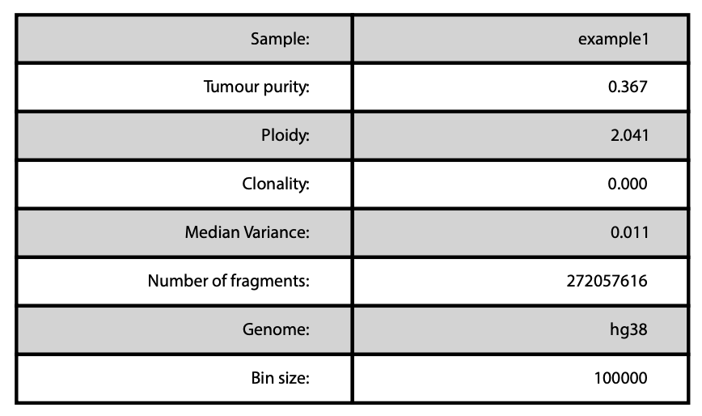
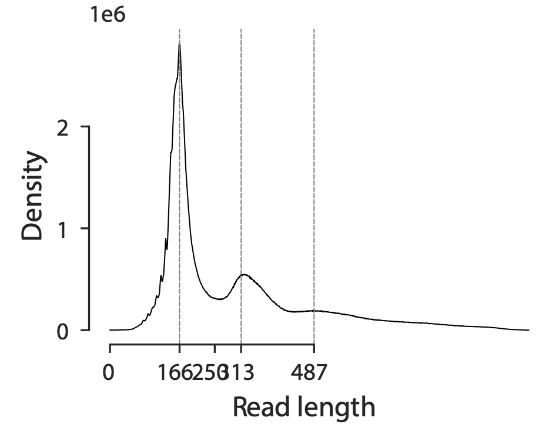
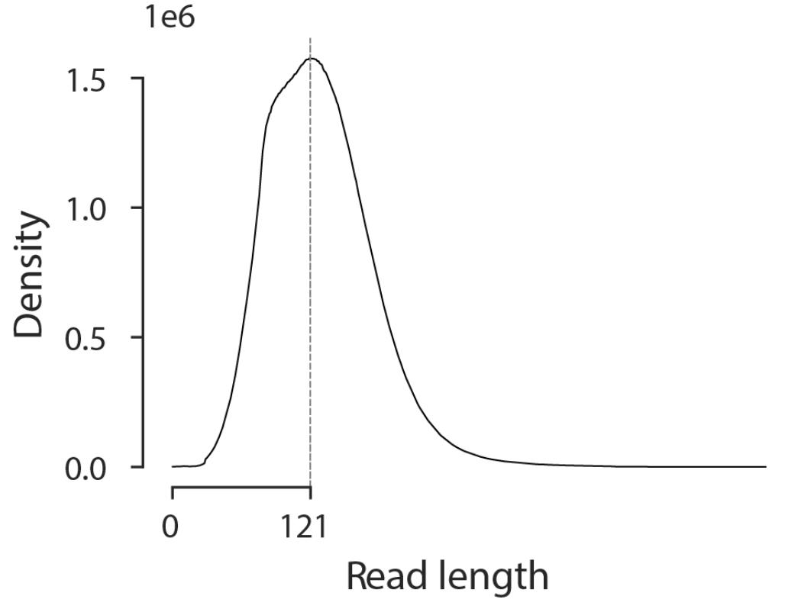
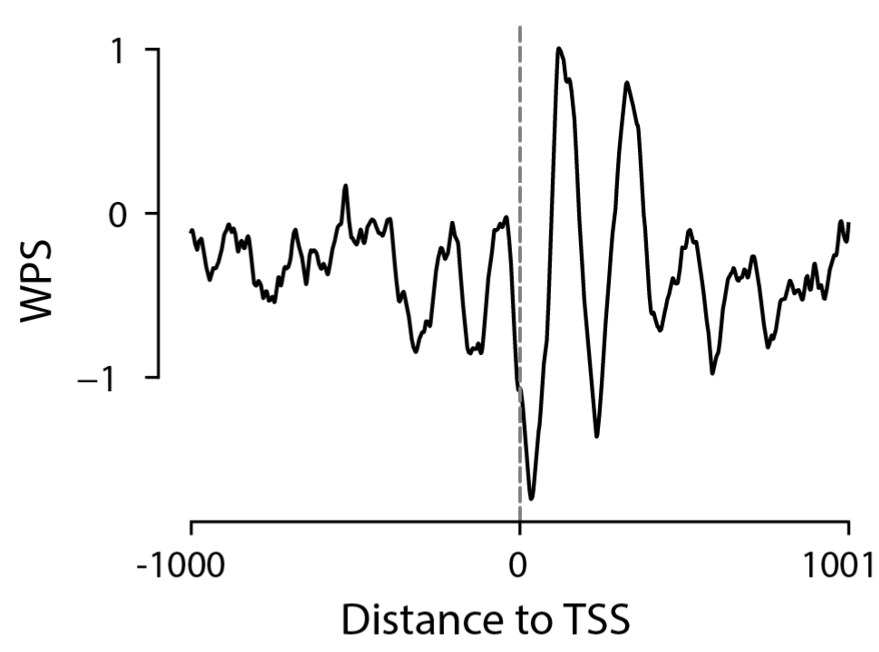
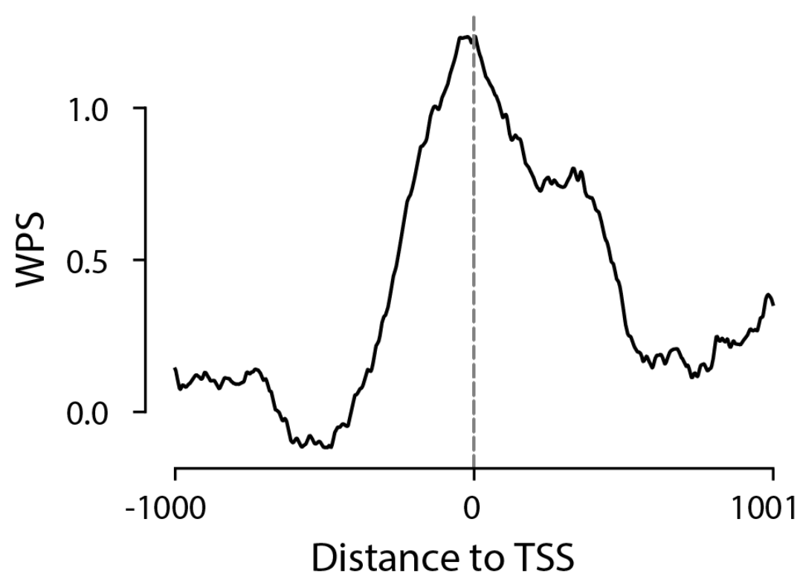
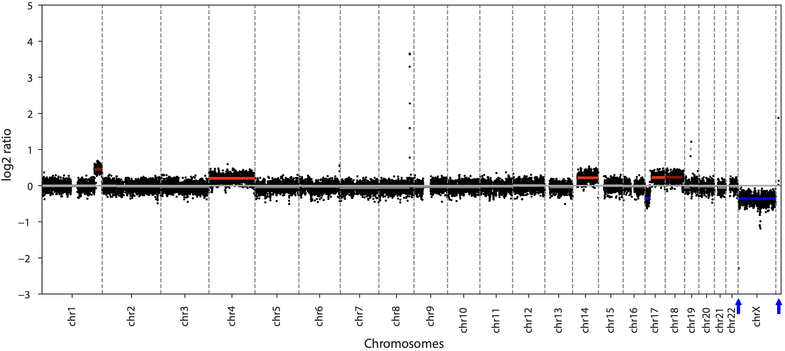
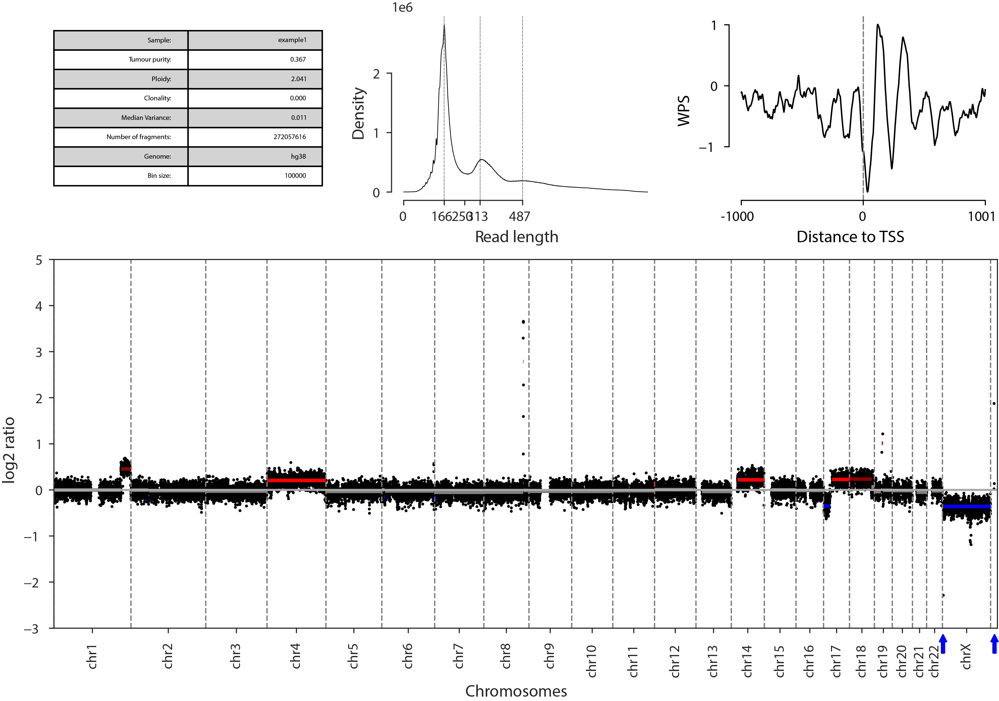
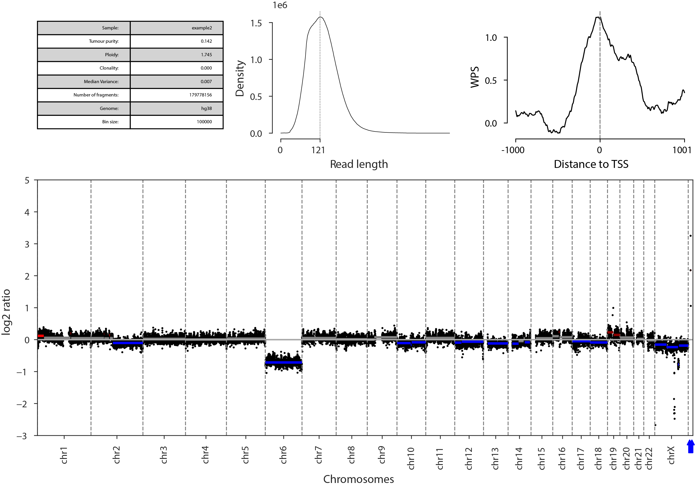

Best Practices
==============

This is a brief tutorial on the best practices for CNV calling in liquid biopsies.

Initial sample preparation, DNA extraction, sequencing, and mapping instructions are
detailed in a previously published `protocol <https://www.sciencedirect.com/science/article/pii/S2666166722001721>`__.

Installation
------------

Anaconda
~~~~~~~~

If you do not have a working Python 3.5 or 3.6 installation, consider
installing Miniconda_. Then run::

    conda install cython numpy pandas scipy scikit-learn matplotlib seaborn bokeh statsmodels h5py

Pull ailist from `PyPI <https://pypi.org/project/cfdna>`__ (consider
using ``pip3`` to access Python 3)::

    pip install pysam
    pip install cfdna

PyPI only
~~~~~~~~~

If you prefer to exclusively use PyPI run::

    pip install cfdna

.. _Miniconda: http://conda.pydata.org/miniconda.html

Commandline
-----------

.. code-block:: bash

	$ python -m cfdna callCNVs --bam example1.bam --genome hg38 --bin_size 100000 --hmm_bin_size 1000000 --nthreads 3 --segs --add_wps --anno_segs --anno_file
	
• --bam example1.bam = deduplicated mapped read file

• --genome hg38 = Genome version

• --bin_size = Bin size to use when calling CNV segments

• --hmm_bin_size = Bin size to use when predicting the tumor purity

• --nthreads 3 = Number of CPU threads to use

• --segs = Output a segmentation file (file name: example1.seg)

• --add_wps = Add a Window Protection Score at all Transcription Start Sites to plot

• --anno_segs = Output a annotated segmentation file (file name: example1_seg_annotations.seg)

• --anno_file = Output a metrics file  (file name: example1_metrics.txt)

This command will run the entire analysis pipeline and output a summary plot of the results, a segmentation 
file for querying called CNVs, and a cache of the analysis in the format of an h5df file. In addition to 
CNVs, the fragment size distribution and average TSS window protection scores are plotted and can be used 
as quality control metrics. There should be a general depletion at the TSS and a osculation pattern around 
the TSS.

CNV calling method
------------------

For each sample, mean fragment coverage is calculated for non-overlapping bins (bin_size = 100000) throughout
the genome and filtered to remove common blacklisted regions. Bin sums are then corrected for GC content and
mappability using LOWESS regression and normalized by taking the log2 ratio between each bin and the median bin
coverage. Copy-number segments are determined from resulting bins using a Bayesian change point approach with a 
heuristic probability threshold of 0.3. The ichorCNA probabilistic model was re-implemented in Python in order
to run faster. The resulting Python package is used to predict tumor purity and ploidy based on larger
bins (hmm_bin_size = 1000000). Additionally, the HMM will predict the status of each segment as amplified,
neutral, or deleted. Any segments within 1.47 Median Absolute Deviations (MADs) of the predicted neutral segments
are determined to also be neutral.

Output: Plot description
------------------------

	
The first plot contains multiple sample-wide metrics.

• Sample: Name based on BAM file

• Tumour purity: Predicted percentage of tumour in sample based on an HMM trained on the CNV profile

• Clonality: Percentage of the genome predicted to be clonal based on an HMM trained on the CNV profile

• Median Variance: Median variance within each CNV segment

• Number of fragments: Number of read pairs after removing marked duplicates

• Genome: Version of the genome used for annotations

• Bin size: Bin size use to call CNV segments

Tumor purities below 0.07 should be manually inspected for false positives as wel as samples with large
median variances (> 0.03).

	
The second plot contains a DNA fragment length distribution for the entire sample. Cell free DNA originates
from nucleosome protected regions of the genome. Therefore, a clean sample will have a mono-nucleosomal
peak between 147 and 170. Additional di- and tri-nucleosomal peaks might also be visible on the plot.

	
This is an example of a DNA fragment length distribution from genomic DNA. Notice the broad distribution without
nucleosomal patterning.

The third plot contains a summary of the average Window Protection Score (WPS: metric for nucleosome presence)
around the Transcription Start Site (TSS) of each gene in the genome. Clean cfDNA samples should display strong
osculations around the TSS and weaker osculations in the flanking regions.

	
This is an example of a WPS plot from genomic DNA. Notice the lack of osculations indicating no nucleosomal patterning.

	
The fourth plot contains the Copy Number Variation (CNV) profile. Predicted amplifications are in red, neutral regions
are grey, and deletions are in blue. Variations outside the bounds of the plot are indicated by red or blue arrows.

Output: Total Plot
------------------

This is an example of a cfDNA CNV profile from a liquid biopsy.

	
This is an example of a CNV profile from genomic DNA.

Output: Seg file preview
------------------------

.. list-table:: Segmentation file
	:widths: 25 15 25 25 15 30
	:header-rows: 1
	
	* - sample
	  - chrom
	  - start
	  - end
	  - n_bins
	  - log2_ratio_median
	* - example1
	  - chr1
	  - 900000
	  - 216700000
	  - 1720
	  - -0.0006
	* - example1
	  - chr1
	  - 216700000
	  - 248900000
	  - 284
	  - 0.4523
	* - example1
	  - chr2
	  - 100000
	  - 242000000
	  - 2143
	  - -0.0150
	* - example1
	  - chr3
	  - 100000
	  - 109400000
	  - 976
	  - -0.0149
	* - example1
	  - chr3
	  - 109400000
	  - 111500000
	  - 20
	  - -0.1836
	* - example1
	  - chr3
	  - 111500000
	  - 198000000
	  - 780
	  - -0.0289
	* - example1
	  - chr4
	  - 100000
	  - 189400000
	  - 1693
	  - 0.2079
	* - example1
	  - chr5
	  - 100000
	  - 181100000
	  - 1577
	  - -0.0270
	* - example1
	  - chr6
	  - 400000
	  - 167900000
	  - 1440
	  - -0.0192
	  
• sample: Sample name from BAM file

• chrom: Chromosome name

• start: Start of the segment

• end: End of the segment

• n_bins: Number of bins in the segment

• log2_ratio_median: Median log2 ratio of the segment

Output: Annotated seg file
--------------------------

.. list-table:: Annotated segmentation file
	:widths: 22 15 21 21 45 35 15 15 20
	:header-rows: 1
	
	* - sample
	  - chrom
	  - start
	  - end
	  - Corrected_Copy_Number
	  - Corrected_Call
	  - var
	  - n_bins
	  - median
	* - example1
	  - chr1
	  - 900000
	  - 216700000
	  - 2
	  - NEUT
	  - 0.0096
	  - 2158
	  - -0.0006
	* - example1
	  - chr1
	  - 216700000
	  - 248900000
	  - 4
	  - HLAMP
	  - 0.0090
	  - 322
	  - 0.4523
	* - example1
	  - chr2
	  - 100000
	  - 242000000
	  - 2
	  - NEUT
	  - 0.0094
	  - 2419
	  - -0.0150
	* - example1
	  - chr3
	  - 100000
	  - 109400000
	  - 2
	  - NEUT
	  - 0.0095
	  - 1093
	  - -0.0149
	* - example1
	  - chr3
	  - 109400000
	  - 111500000
	  - 1
	  - HETD
	  - 0.0061
	  - 21
	  - -0.1836
	* - example1
	  - chr3
	  - 111500000
	  - 198000000
	  - 2
	  - NEUT
	  - 0.0096
	  - 865
	  - -0.0289
	* - example1
	  - chr4
	  - 100000
	  - 189400000
	  - 3
	  - GAIN
	  - 0.0090
	  - 1893
	  - 0.2079
	* - example1
	  - chr5
	  - 100000
	  - 181100000
	  - 2
	  - NEUT
	  - 0.0094
	  - 1810
	  - -0.0270
	* - example1
	  - chr6
	  - 400000
	  - 167900000
	  - 2
	  - NEUT
	  - 0.0099
	  - 1675
	  - -0.0192

• sample: Sample name from BAM file

• chrom: Chromosome name

• start: Start of the segment

• end: End of the segment

• Corrected_Copy_Number: Final Copy Number as an integer

• Corrected_Call: Final prediction of segment status (deleted, neutral, amplified)

• var: Variance of the bins within the segment

• n_bins: Number of bins in the segment

• median: Median log2 ratio of bins in the segment

Output: Metrics file
--------------------

.. list-table:: Metrics file
	:widths: 20 20 30 10 10 10
	:header-rows: 1
	
	* - 
	  - n_fragments
	  - predicted_gender
	  - purity
	  - ploidy
	  - clonal
	* - example1
	  - 25487104.0
	  - female
	  - 0.3664
	  - 2.0412
	  - 0.0

• n_fragments: Number of read pairs after removing marked duplicates

• predicted_gender: Predicted gender based on chrX coverage

• purity: Predicted tumour purity

• ploidy: Predicted tumour ploidy

• clonal: Predicted genome clonal fraction
